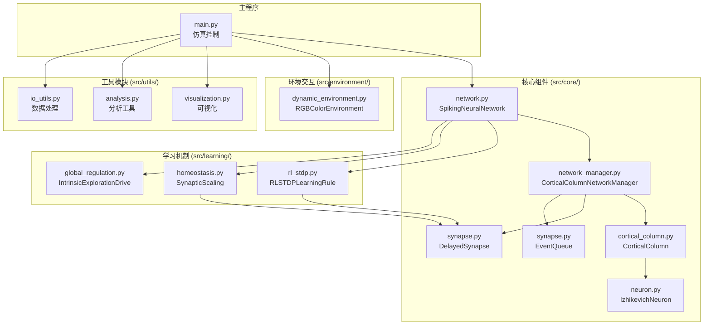
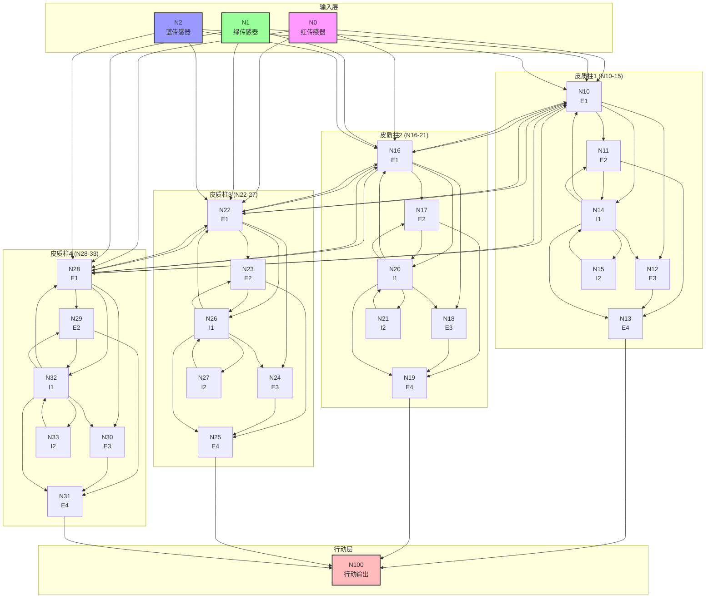
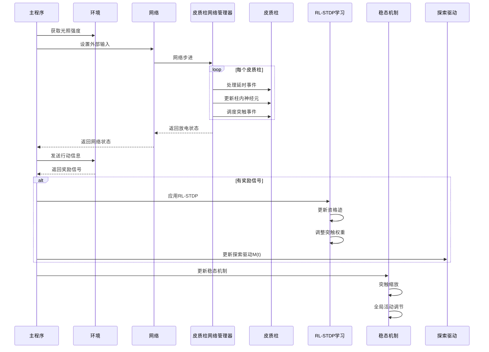
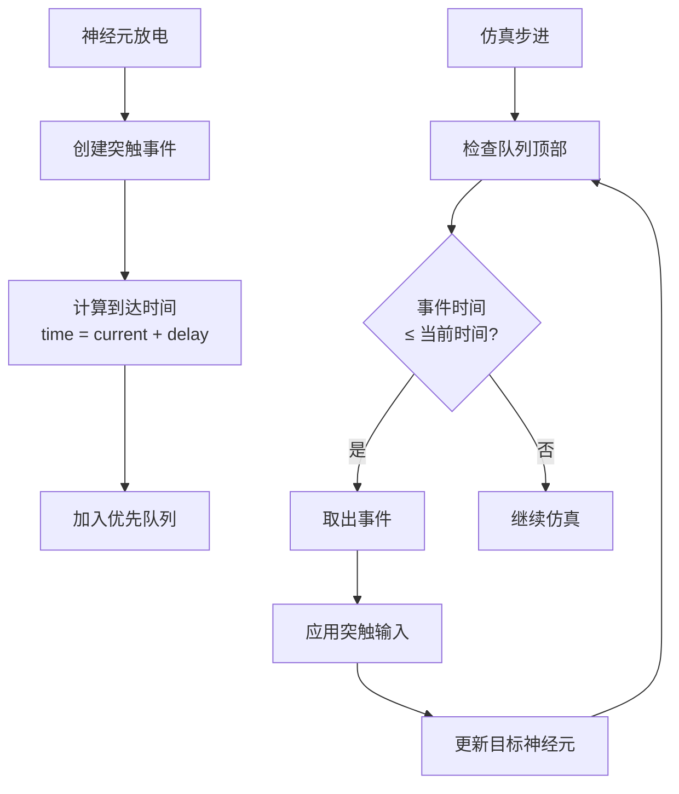
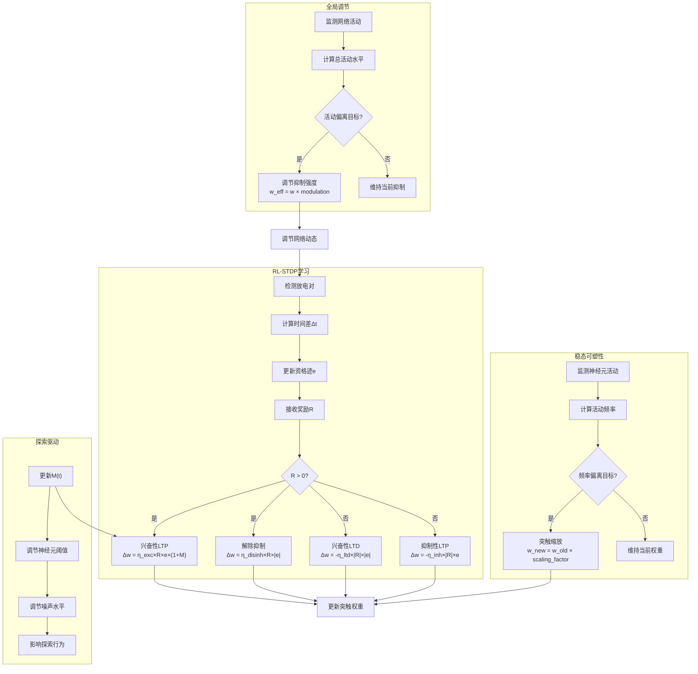

# 皮质柱脉冲神经网络架构说明

## 总体架构

本项目采用**皮质柱微电路**作为核心构建单元，实现生物启发的脉冲神经网络。系统集成了多层次学习机制和稳态调节，模拟大脑皮层的信息处理模式。整体架构分为核心组件、学习机制、环境交互和工具模块四个主要部分。

## 网络架构

### 层级结构
- **输入层**: 3个神经元 (ID: 0, 1, 2) - 环境传感器
- **隐藏层**: 4个皮质柱 × 6个神经元 = 24个神经元 (ID: 10-33) - 特征处理
- **行动层**: 1个神经元 (ID: 100) - 决策输出

### 皮质柱微电路
每个皮质柱模拟大脑皮层的基本处理单元：
- **4个兴奋性神经元** (E1-E4): 信号放大和模式维持  
- **2个抑制性神经元** (I1-I2): 竞争选择和稳定控制

## 模块结构

### 核心组件 (src/core/)

#### **神经元模块** (neuron.py)
- **IzhikevichNeuron**: Izhikevich神经元模型
  - 生理参数和重置规则
  - 支持基础噪声注入
  - 兴奋性/抑制性/输入/行动神经元差异化参数

#### **突触模块** (synapse.py)  
- **DelayedSynapse**: 带传导延时的突触类
- **SynapticEvent**: 突触事件封装
- **EventQueue**: 优先队列事件管理器

#### **皮质柱模块** (cortical_column.py)
- **CorticalColumn**: 6神经元微电路
  - 规范化柱内连接（循环兴奋+反馈抑制+广泛抑制）
  - 目标神经元和输出神经元访问接口

#### **网络管理器** (network_manager.py)  
- **CorticalColumnNetworkManager**: 皮质柱网络管理
  - 28神经元网络创建和管理
  - 层间连接模式：
    - 输入→隐藏 (皮质柱)：80%连接概率，权重 5.0-15.0
    - 隐藏柱间：40%连接概率，兴奋性权重 3.0-8.0，抑制性权重 -8.0到-3.0
    - 隐藏→行动：60%连接概率，兴奋性权重 8.0-20.0，抑制性权重 -15.0到-5.0
  - 事件驱动仿真引擎
  - 学习和稳态机制集成

#### **网络接口** (network.py)
- **SpikingNeuralNetwork**: 主网络接口
  - 向后兼容的API设计
  - 网络管理器封装
  - 统一的仿真控制接口

### 学习机制 (src/learning/)

#### **RL-STDP学习** (rl_stdp.py)
- **RLSTDPLearningRule**: 奖励调节STDP
  - 差异化学习率（兴奋性LTP/LTD，抑制性LTP，解除抑制）
  - 资格迹管理和衰减
  - 通过奖励间接影响学习效果

#### **稳态可塑性** (homeostasis.py)
- **SynapticScaling**: 突触缩放机制
  - 个体神经元活动频率稳态
  - 仅作用于兴奋性突触
  - 目标频率2.0Hz，时间窗口1000.0ms
  
- **GlobalActivityRegulator**: 全局活动调节
  - 网络整体兴奋-抑制平衡
  - 抑制强度动态调节
  - 目标活动5.0Hz，调节强度0.3

#### **全局调节** (global_regulation.py)
- **IntrinsicExplorationDrive**: 内在探索驱动
  - 动机水平M(t)动态调节
  - 奖励增强+惩罚抑制+停滞复苏
  - 神经元兴奋性调制

### 环境交互 (src/environment/)

#### **动态环境** (dynamic_environment.py)
- **RGBColorEnvironment**: 动态RGB颜色环境
  - 每个RGB通道采用sin(ωAₜ)×cos(ωBₜ)函数独立变化
  - 随机频率参数控制0.5-1秒周期
  - 颜色值进行**减0.5并取最大值0**的处理
  - 仅当纯绿色激活(绿>0.8，红蓝<0.2)且行动神经元放电时给予+10奖励
  - 非纯绿色状态下的行动给予-2惩罚

### 工具模块 (src/utils/)

#### **可视化** (visualization.py)
- 网络活动时序图
- 膜电位动态展示
- M(t)探索驱动可视化

#### **分析工具** (analysis.py, data_utils.py, io_utils.py)
- 性能指标计算
- 数据处理和保存
- 仿真结果分析

## 系统架构图



## 皮质柱网络拓扑



## 数据流架构



## 事件调度机制



## 多层次学习机制



## 关键设计特点

### 1. 皮质柱微电路架构
- 模拟大脑皮层的基本处理单元
- 每柱6神经元（4兴奋+2抑制）的规范化结构
- 生物合理的柱内连接模式
- 支持特征检测和竞争选择

### 2. 多层次可塑性机制
- **RL-STDP**: 奖励调节的突触可塑性
- **稳态可塑性**: 突触缩放维持神经元活动稳定
- **全局调节**: 动态平衡网络兴奋-抑制状态
- **探索驱动**: 内在动机驱动的适应性行为

### 3. 事件驱动仿真架构
- 优先队列精确管理突触延时
- 生物合理的传导延时(0.5-2.5ms)
- 高效的事件调度和时序控制
- 支持大规模网络仿真

### 4. 差异化学习规则
- 兴奋性突触：LTP/LTD双向可塑性
- 抑制性突触：增强和解除抑制机制
- 不同突触类型的独立学习率
- 探索驱动调制学习效率

### 5. 模块化可扩展设计
- 核心组件低耦合高内聚
- 统一的网络接口API
- 支持新皮质柱类型扩展
- 便于添加新学习机制

## 性能优化策略

### 1. 内存管理
- 事件队列动态管理，避免内存泄漏
- 皮质柱内部稀疏连接存储
- 历史数据定期清理机制

### 2. 计算优化
- 向量化神经元状态更新
- 并行处理皮质柱内计算
- 优化事件队列操作复杂度

### 3. 数据结构优化
- 使用高效的优先队列实现
- 神经元和突触的索引优化
- 稀疏矩阵存储连接权重

## 扩展性设计

### 添加新皮质柱类型
```python
# 继承基础CorticalColumn类
class CustomCorticalColumn(CorticalColumn):
    def _create_internal_connections(self):
        # 实现自定义柱内连接模式
        pass
        
    def get_target_neurons(self):
        # 返回接受输入的神经元
        return [custom_target_list]
```

### 集成新学习机制
```python
# 在CorticalColumnNetworkManager中添加
def add_learning_rule(self, learning_rule):
    self.learning_rules.append(learning_rule)
    learning_rule.initialize(self.synapses)
```

### 扩展环境接口  
```python
# 实现新的环境类型
class CustomEnvironment(DynamicEnvironment):
    def calculate_reward(self, action, state):
        # 实现自定义奖励机制
        return custom_reward
```

---

本架构设计结合了生物神经科学原理和工程实现需求，为皮质柱脉冲神经网络提供了可扩展、高效的系统框架。通过模块化设计和多层次学习机制，系统能够适应复杂的学习任务并保持良好的可维护性。